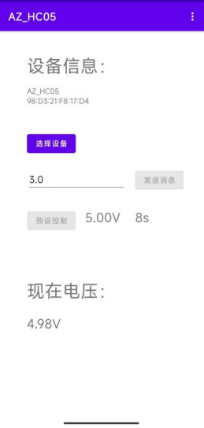
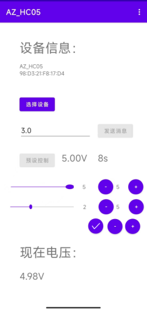

# SmartPower
电路模电课程实训项目的安卓端蓝牙控制应用

----

## 总体介绍
简单来说就是一个电路模电课程里一边学一边写的草率蓝牙安卓应用，其功能是控制我们的“可编程电源”。（控制单片机调整数控电阻模块以调整输出电压）

目前其功能大致实现了将：
- 与我们的可编程电源进行连接和控制
- 将单片机以每秒十次的频率测得的运放输入端电压显示在“现在电压”处
- 通过”发送消息“处直接设置可编程电源输出电压
- 可使用预设控制使输出完成一组满足项目要求的 3V-4V-5V 每档停留 10s 的效果
- 可根据需要设置修正单片机 5V 端测得的电压值，以修正测量端测得的电压精度。

主界面：

基准电压界面：

或者更普适地这样解释功能：
- 与已配对的基础的蓝牙通信模块连接（测试过 BT-06 及 HC-05）
- 通过“测量基准电压”设置修正值 $V_0$
- 接受蓝牙串口发来的`(int)`形式的数据 $x$，对其计算后将 $V_0\times\frac{x}{1024}$ 保留两位小数显示在“现在电压”处
*（现在想想好像应该除以 1023 吗？）
- “发送消息”将输入的值 $x$ 按 $\lfloor\frac{x}{V_0}\times1024\rfloor$ 计算后通过蓝牙串口以`(int)`的形式发送
- “预设控制”向蓝牙串口发送一组基于上一条规则依次发送的 3V-4V-5V-3V 控制指令，之间间隔 10s

然而时间上之类的的各种原因，很多预想功能都没能做出来。有时间或许还会再更新，但也别指望就是了……

LICENSE 必要吗？姑且选了一个宽容的 MIT LICENSE，总之也是学习中的不成气代码，如果还能帮到自己之外的人那就是无比荣幸了。

老实说其实这个项目其实没有多大质量，主要是出于个人“想完成一点事”的感觉而去初步完善。

----

## 目前主要问题
目前还有一堆 bug 没改补，整个项目一堆错误和警告。不过毕竟算是自己第一个相对正经的项目，感觉也还在接受范围之内。（能跑就行.jpg）

现有功能相关的一些主要问题：
- 没有未获得权限的安全检测，不提前给权限会闪退
- UI 未在其他机型上测试过，可能会在别的手机上坏掉
- 只能对手机已经预先配对过的设备进行选择连接
- 只使用的 Activity 实现控制，没有使用Service，不在前台可能会被系统鲨了

~~人生的第一座屎山~~

----

## 之后更新计划
~~（极大概率会鸽）~~

主要设想是把 UI 做成这样：

可以在现在电压上方添加一个板块，制作一个可滑动的列表，其中存储着多条信息，每条信息中包含拖动条调整输出电压和加减按钮控制该电压值持续时间。（拖动条最小值为0，最大值为当前测量基准电压）板块下方的加减按钮可在列表末端增减条目，确认后点击运行，则应用按照这个列表中的每条设置顺次执行控制指令。
另外也应可以设置控制指令是否循环执行，并设置打断此控制的中断按钮。此外还可。此外还可设计允许将一个编辑好的列表存储在本地数据库中，使之成为脚本本运行下次读取，并设置base64编码的对脚本的导入导出功能，允许用户通过通讯软件便捷地分享脚本。

似乎因为图片重新从论文里导出的所以分辨率不太行

----

## 项目相关非安卓部分
正如前面所介绍的，这个 App 整个是电路模电课程的实训项目里搓出来的半成品，App 中里很多内容都需要直接对应匹配相应的硬件项目

主要包含以下内容：
- `\ProjectPart\Doc` （暂无）
~~项目论文，对应的时间应该是 v1.2.1 版本，隐藏了一些隐私信息~~
想想还是暂且不放了

- `\ProjectPart\Arduino`
项目用的是 ArduinoNano 单片机加上 12V VIN 从引脚供电，单片机通过模拟输入引脚测量电压，通过数字引脚控制 x9c104 数控电阻模块调整输出电压
这里附的主要是最后烧录的代码，因为单片机测量脚最后烧了重新飞线了，所以代码和原理图定义得不一样

- `\ProjectPart\Hardware`
项目某版本不完整电路图，一些不完整的原理图，一点实物照片

----

## 部分来源
其中的蓝牙连接部分使用的控制方式和代码主要来自[这篇文章](https://www.jb51.net/article/259346.htm)

基础的 Java 和 Android 的结构性知识分别来源于 *《HeadFirstJava™》* 和 *《第一行代码 Android 第2版》*。

然后各种 UI 和组件的基本使用方法学习中很多其实是问 ChatGPT 学来的，感慨啊…… AI 确实厉害了……

----